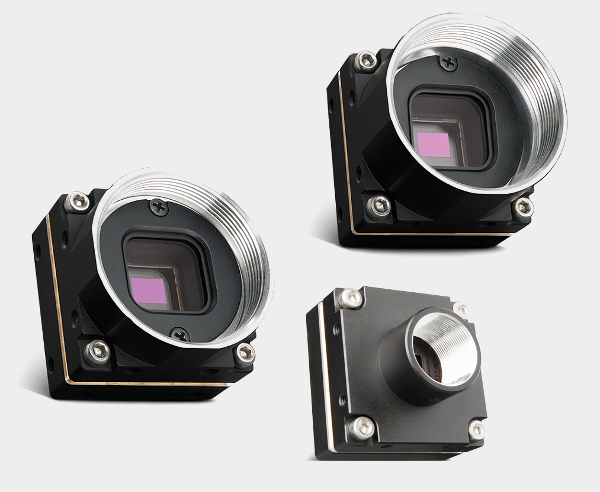

<!-- PROJECT SHIELDS -->
<!--
*** I'm using markdown "reference style" links for readability.
*** Reference links are enclosed in brackets [ ] instead of parentheses ( ).
*** See the bottom of this document for the declaration of the reference variables
*** for build-url, contributors-url, etc. This is an optional, concise syntax you may use.
*** https://www.markdownguide.org/basic-syntax/#reference-style-links
-->
[![Build Status][build-shield]][build-url]
[![Contributors][contributors-shield]][contributors-url]
[![MIT License][license-shield]][license-url]
[![LinkedIn][linkedin-shield]][linkedin-url]


<!-- PROJECT LOGO -->
<br />
<p align="center">
  <a href="https://github.com/gilbo123/PyspinCameras">
    
  </a>

  <h3 align="center">Pyspin Cameras</h3>

  <p align="center">
    A simple wrapper for the PySpin library to allow for easy control of FLIR cameras.
    <br />
    <a href="https://github.com/gilbo123/PyspinCameras"><strong>Explore the docs »</strong></a>
    <br />
    <br />
    <a href="https://github.com/gilbo123/PyspinCameras">View Demo</a>
    ·
    <a href="https://github.com/gilbo123/PyspinCameras/issues">Report Bug</a>
    ·
    <a href="https://github.com/gilbo123/PyspinCameras/issues">Request Feature</a>
  </p>
</p>


<!-- TABLE OF CONTENTS -->
## Table of Contents

* [About the Project](#about-the-project)
  * [Built With](#built-with)
* [Getting Started](#getting-started)
  * [Prerequisites](#prerequisites)
  * [Installation](#installation)
* [Usage](#usage)
* [Contributing](#contributing)
* [License](#license)
* [Contact](#contact)


<!-- ABOUT THE PROJECT -->
## About The Project

[![Cameras blackfly-s][product-screenshot]](https://example.com)

This project is a simple wrapper for the PySpin library to allow for easy control of FLIR cameras.

Features:
* Fast and easy to use.
  * Get camera information.
  * Set camera parameters.
  * Acquire images.
* Image queueing.
* Image event callback function.

### Built With

Frameworks used in the application:

* [![Python][python-shield]](https://www.python.org/)


<!-- GETTING STARTED -->
## Getting Started

This project requires a FLIR camera and the PySpin library to be installed.

### Prerequisites

* PySpin

Follow the instructions [here](https://www.teledynevisionsolutions.com/products/spinnaker-sdk/) to install the PySpin library.
__Note:__ You may need to install the SDK depending on the camera you have. This package has been tested using SDK version 3.0.0.117 and 3.1.0.79.

### Installation

1. Clone the repo
```sh
git clone https://github.com/gilbo123/PyspinCameras.git
```
```sh
cd PyspinCameras
```
3. Install requirements
```sh
pip3 install -r requirements.txt
```

<!-- USAGE EXAMPLES -->
## Usage - Basic

```python
# reference to PySpin
system: PySpin.System = PySpin.System.GetInstance()

# reference to the cameras
cameras: Cameras = Cameras(system=system)

# initialise the cameras
cameras.initialise_cameras()

# acquire 10 images
cameras.acquire_images(num_images=10)
# alternatively, acquire images until the user presses 'Ctrl+C'
# cameras.acquire_images()

# release the cameras
cameras.release_all_cameras()

# dereference the system
system.ReleaseInstance()

```

```python
# go through each camera 
for i, cam in enumerate(cameras):
    # set parameters
    cam.set_pixel_format(PySpin.PixelFormat_Mono8)
    cam.set_acquisition_mode(acq_mode="continuous")
    cam.set_frame_rate(frame_rate=20.0)
    cam.set_stream_buffer_mode(buffer_mode="newest_only")
    cam.set_trigger_mode(trigger_mode="off")

    #set callback
    cam.set_callback_function(callback)
```

Get a camera by serial number.
```python
cam: PySpin.Camera = cameras.get_camera_by_serial("24132701")
```

Get a camera by index.
```python
cam: PySpin.Camera = cameras[0]
```

Enumerate through the cameras.
```python
for i, cam in enumerate(cameras):
    print(cam)
```

Get a dictionary of the camera info.
```python
cam_info: dict[str, str] = cameras.camera_info
print(cam_info)
```

Print the version info.
```python
print(cameras.version_info)
```
Example output:
``` 
SpinCameras v0.0.2 - Spinnaker v3.1.0.79
```
## Usage - \_ \_repr\_ \_ methods:
```python
cameras: Cameras = Cameras(system=system)
print(cameras)
```
Example output:
```
Cameras(
  Spinnaker version: 3.1.0.79
  Number of cameras detected: 1
  Save folder: None
  Queue size: [0]
  Camera details: 
      Camera 1 of 1 - Model: Firefly FFY-U3-16S2M (24236399)
)
```
```python
cam: PySpin.Camera = cameras.get_camera_by_serial("24236399")
print(cam)
```
Example output:
```
Camera(
  Model: Firefly FFY-U3-16S2M (Serial: 24236399)
  Index: 1 (out of 1 cameras)
  Temperature: 61.85℃
  Initialised: True
  Streaming: False
  Callback set: False
)
```


## Usage - Image Queueing

```python
# reference to PySpin
system: PySpin.System = PySpin.System.GetInstance()

# reference to the queue
queue: Queue = Queue()

# pass the queue to the cameras
cameras: Cameras = Cameras(system=system, queue=queue)

# initialise the cameras
cameras.initialise_cameras()

# acquire 10 images
Thread(target=cameras.acquire_images, kwargs={"num_images": 10}).start()

# access the queue
for i in range(10):
    image_dict: dict[str, Any] = queue.get()
    # convert to numpy array
    image_numpy: ndarray = image_dict["image"].GetNDArray()
    
    print(image_numpy.shape)
    print(image_dict["filename"])
    
    # do something with the image

```

## Usage - Image Event Callback

Callbacks can be set to each camera individually using the `set_callback_function` method. E.g.
```python
cameras.get_camera_by_serial("24236399").set_callback_function(callback)
```
Where `callback` is a function or class that takes a camera and image as arguments.

Callback class example:
```python
@dataclass
class CameraImageCallBack:
    """Callback to save images"""

    save_folder: str

    def __call__(self, image_converted: PySpin.Image, filename: str) -> None:
        """
        Callback to save images

        :param image_converted: Image
        :type image_converted: Image
        :param filename: Filename
        :type filename: str
        """

        # convert to numpy array
        image_converted_numpy: ndarray = image_converted.GetNDArray()

        print(f"Image shape: {image_converted_numpy.shape}")

        # save the image
        print(f"Callback CLASS - Image {filename} saved.")

        # anything else you want to do with the image
        ## convert to RGB
        # image_converted_numpy = cv2.cvtColor(image_converted_numpy, cv2.COLOR_BGR2RGB)  # type: ignore

        ## display the image
        # cv2.imshow(cam_id, image_converted_numpy)  # type: ignore
        # cv2.waitKey(1)  # type: ignore

        ## save the image
        # cv2.imwrite(f"{self.save_folder}/{filename}", image_converted_numpy)  # type: ignore

```
Pass the callback class to the `set_callback_function` method.
```python
callback: CameraImageCallBack = CameraImageCallBack(save_folder="images")
camera: Camera = cameras.get_camera_by_serial("24236399")
camera.set_callback_function(callback)
```

_For more examples, please refer to the [Documentation](https://example.com)_


<!-- CONTRIBUTING -->
## Contributing

Contributions are what make the open source community such an amazing place to be learn, inspire, and create. Any contributions you make are **greatly appreciated**.

1. Fork the Project
2. Create your Feature Branch (`git checkout -b feature/AmazingFeature`)
3. Commit your Changes (`git commit -m 'Add some AmazingFeature'`)
4. Push to the Branch (`git push origin feature/AmazingFeature`)
5. Open a Pull Request


<!-- LICENSE -->
## License

Distributed under the MIT License. See `LICENSE` for more information.


<!-- CONTACT -->
## Contact

* Gilbert Eaton - [@mechatronicdoc](https://x.com/mechatronicdoc) - gilberteaton@gmail.com
* Jonathon Holder - [@]() - jonathon.holder.90@gmail.com

Project Link: [https://github.com/gilbo123/PyspinCameras](https://github.com/gilbo123/PyspinCameras)


<!-- MARKDOWN LINKS & IMAGES -->
<!-- https://www.markdownguide.org/basic-syntax/#reference-style-links -->
[build-shield]: https://img.shields.io/badge/build-passing-brightgreen.svg?style=flat-square
[build-url]: #
[contributors-shield]: https://img.shields.io/github/contributors/gilbo123/PyspinCameras.svg?style=flat-square
[contributors-url]: https://github.com/gilbo123/PyspinCameras/graphs/contributors
[license-shield]: https://img.shields.io/badge/license-MIT-blue.svg?style=flat-square
[license-url]: https://github.com/gilbo123/PyspinCameras/blob/master/LICENSE.txt
[linkedin-shield]: https://img.shields.io/badge/-LinkedIn-black.svg?style=flat-square&logo=linkedin&colorB=555
[linkedin-url]: https://linkedin.com
[product-screenshot]: assets/firefly-s.png
[python-shield]: https://img.shields.io/badge/Python-14354C?style=for-the-badge&logo=python&logoColor=white
